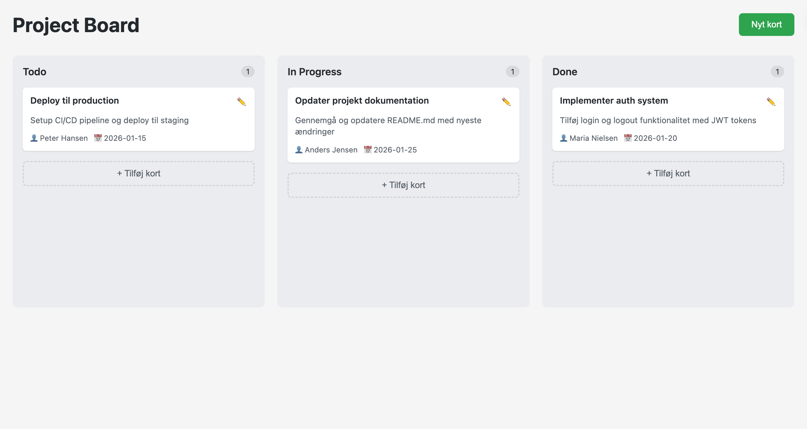
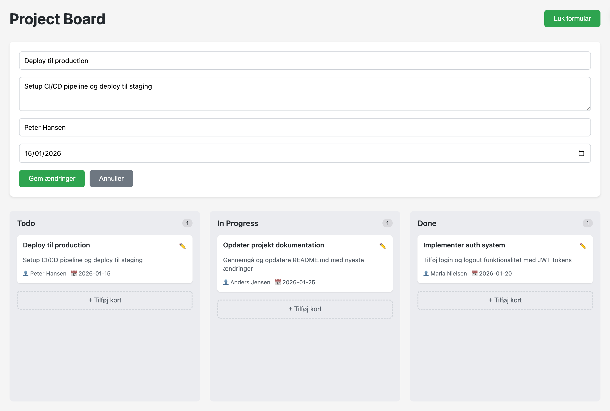

# Project Board App

En board baseret Project Board applikation bygget i React (JavaScript).

Projektet er lavet for at vise praktisk frontend-arbejde med fokus på struktur, brugerflow og state management.

## Kort om projektet
- Tre kolonner: **Todo**, **In Progress**, **Done**
- Opret, rediger og slet cards
- Drag & drop mellem kolonner med **@dnd-kit**
- Data gemmes automatisk via **localStorage**

Workflowet er inspireret af board-baserede værktøjer som GitHub Projects.

## Screenshots

---

## Tech
- React (hooks)
- Vite
- @dnd-kit
- CSS
- localStorage

---

## Projektstruktur
Projektet er opdelt i tydelige komponenter med hvert sit ansvar:

- **Board.jsx**  
  Indeholder hovedlogik, state, localStorage og drag & drop

- **Column.jsx**  
  Viser en kolonne og fungerer som drop zone

- **Card.jsx**  
  Viser et enkelt card og gør det draggable

- **CardForm.jsx**  
  Bruges til oprettelse og redigering af cards

- **storage.js**  
  Hjælpefunktioner til håndtering af localStorage

